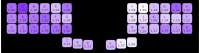
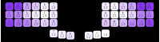

# 42 key effort grid for Glove80

## Introduction

The results on this page are timings on a 42-key setup on Glove80 (on "upper thumb key row"). The used layout is 

```
1qwert       uyiop4
2asdfg       hjklö5
3zxcvb       nm,.-6
     789   =+§

```
- Pictures use US alternatives ";/\`" instead of the "ö-§" which are used in data files.

## How these were recorded?

The trigram timings were recorded with the `effort_grid_record` CLI tool (See: [HOW-TO-USE](HOW-TO-USE.md)). For each of the 42 keys on the keyboard, 10 random trigrams were used. Rules for trigram selection: each character on a trigram must correspond to different finger, and each trigram must be unique. Recording each trigram was repeated *7 times*. 


 The timing recording process for each trigram was:
 - First type the *Home Key Sequence* (SDF or LKJ). Time timer starts when the last key was pressed down and at least one key was released after it.
 - Type trigram (three characters)
 - Repeat Home Key Sequence (SDF or LKJ). The timer ends when the last key of the sequence was pressed and at least one key was released after it.

The home key sequence was used to that the starting and ending point is on home row, and it also gave basis for timing. On each trigram, I practiced a bit before any trials to make the key location to be the dominant factor (and not my memory). In summary, there are timings for 420 trigrams and 2940 recorded timings, and the recording process took 6.5 hours.

## Trigram timings

The raw data results are shown in [raw-trigram-timings.txt](raw-trigram-timings.txt). From each 7 repetitions, 3 best times were used. The averages of each three best timings are stored in [average-trigram-timings.txt](average-trigram-timings.txt)  for convenience.

Note that there is bias for each trigram timing coming from the Home Key Sequence. That bias was estimated with `effort.keyboard.estimate_bias` to be roughly 0.212 seconds with left and 0.223 with right hand. The trigram files mentioned above still contain the bias in the timings.

## Trigram timings: Center characters

If you only consider the middle character of each trigram, you get 10 recordings per character. Taking simply the average time for each character and subtracting the bias (~220ms), and normalizing by dividing with smallest timing (295 ms) you will get:


### Comments
- There's not much structure in this
- The sample size is quite small. Only 10 trigrams per character


<details>
<summary>The command used</summary>

```
effort_grid_show effortconfig.yaml raw-trigram-timings.txt --type=average-center
```
</details>


## Trigram timings: All characers of trigram

If timing for each character is calculated as the average of all timing for all trigrams containing the character (at any position; not just middle)  you get more recordings per character. 

After subtracting the bias (~220ms) and normalizing by dividing with smallest timing (372 ms) you will get:



### Comments
- This shows a bit more structure: All trigrams with thumb or index finger seem to be faster to type.
- Inner keys (index finger) are faster to type than outer keys (pinky)
- Pinky upper key is terrible
- The home keys are not as fast as I would have guessed. Especially middle finger. More on that later.
- The sample sizes are a bit bigger; from 16 to 49 trigrams per character, and 30 on average. See: [sample-sizes.txt](sample-sizes.txt).

<details>
<summary>The command used</summary>

```
effort_grid_show effortconfig.yaml raw-trigram-timings.txt --type=average
```
</details>


## Character Timings: Linear model


I thought this would be the most accurate way of getting the timings information. I've written some explanations in the [HOW-TO-USE.md](HOW-TO-USE.md)

The idea is to use simple model that estimates the timing of **each character** (the two previous attempts show timing of the whole trigram containing the character). So in essence, for each trigram timing, split the timing to the three characters using a model ([sklearn.linear_model.LinearRegression](https://scikit-learn.org/1.5/modules/generated/sklearn.linear_model.LinearRegression.html)).


Again, the bias (~220ms depending on hand) was removed and then results were normalized to 1.0 (1.0 means 75 ms in real life). The resulting heatmap is:


### Comments
- This heatmap has the clearest structure
- Thumb keys are really fast
- The **index fingers** are also considered really fast -- even the inner columns. 
- The **Home Row** (expect for index finger) is much slower than I thought. One guess for this is the _recording setup_ used: I used the Home Key Sequence SDF or JKL or start and end the recording. If the _trigram_ in question also contained character(s) from the home key sequence, it might made it more difficult (lot's of same keys with varying directions). Try, for example to type as fast as possible: LKJ KLJ LKJ. It would be easier to type KLJ isolated from the LKJ's, but then there should be another solution to start the recording. Perhaps the recording start should have accepted the Home Key Sequence in _any order_?
- **Trigram direction**: Another very strong point that I learned is that the _position_  of the key is only a small portion of the overall timing for the trigram. The _direction_ of the trigram has far more effect! I was thinking having random samples would average this effect a lot, but actually the sample size is not so large (16 to 49, averages on 30 trigrams per character). Recording 10 or 100 times larger dataset is not very feasible as this already took 6.5hrs of active typing. If I would record this again, I probably would allow any direction for the given trigram, and always choose the easiest one (give more weight to the key location and less to the trigram directions).
- The sample sizes are again: from 16 to 49 trigrams per character, and 30 on average. See: [sample-sizes.txt](sample-sizes.txt). The trigrams were completely random, but distribution to keys was not even. 
- I don't believe there's such a difference between the different thumb keys in reality. These results say that difference within one cluster the difference can be ~0.4. That gives a good rule of thumb: Any number elsewhere could be also off by that amount easily (because of just worse/better luck with trigram selection for the character)
- I trust the results overall with some grains of salt: The JKL, SDF are probably better than shown here. 

<details>
<summary>The command used</summary>

```
effort_grid_show effortconfig.yaml raw-trigram-timings.txt --type=model
```
</details>


## Other things I learned

- Typing ERZ is much easier than typing ERQ. I really dislike the "same row pinky" Q. Not sure what's the name of this phenomenon.
- I generally **dislike bigrams with pinky+(ring|middle)**.  But the ERQ/ERZ thing is a good example that if the pinky is lower, then **pinky+middle** is okayish.
- **pinky + index**  is surprizingly good. No problems at all. Could be because I can move index finger isolation from other fingers (but moving ring affects also middle and pinky).
- Using a **thumb** in a trigram gives superpowers. Thumbs are _fast_.
- **Index finger inner columns** are surprisingly good. I don't know why they're getting so much hate. One thing affecting here might be the fact that index finger is more "isolated" from other fingers (you can move it without moving other finders)?

## What would be my effort grid? 


- I believe that the effort grid calculated by the linear model are close to what I am experiencing, with some modifications: Home Row keys must get a reduction (the numbers were inflated because of the measurement setup, as discussed above), and by smoothening out the calculated effor a bit since there's still lot of variance (caused by the small sample size).
- The best estimate of the effort grid is, with some iterations using the keyboard and comparing key efforts in practice, while trying to keep loyal to the results from the experiment:

